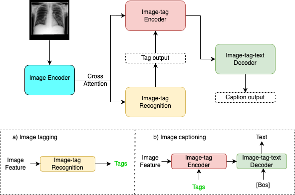

  
# VTG-Transformer: A novel model for medical image captioning from Chest X-ray images

### Requirements

- Follow in file: script_init_env

### Download VTG-transformer

You can download the experiments we trained each dataset from [here](https://drive.google.com/file/d/1Pl4IP7Hs3GWB-Xt6SpfiU858GUyebCL8/view?usp=sharing)

### Dataset

- IU: Can you download dataset we preprocessed from [here](https://drive.google.com/file/d/1uztNyXUudANhKF9qMRR1o8pxnmw-pt-Y/view?usp=sharing)
- Ad-hoc: Can you send email to me: trantanthanh0510@gmail.com

### Run

- Please go through file [main.py](https://github.com/tanthanh0510/VTG-Transformer/blob/main/main.py#L10) to see the detail information of all parameters.

- Train: script_train

- Test: script_test
